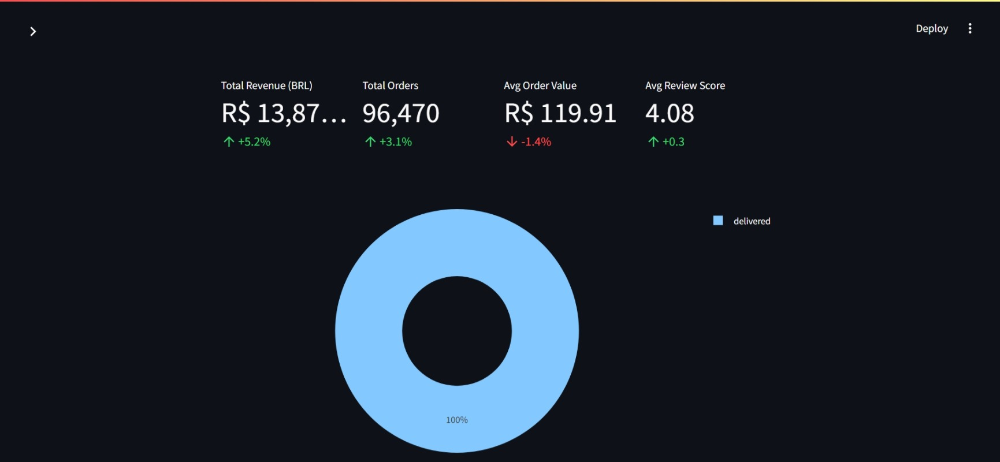
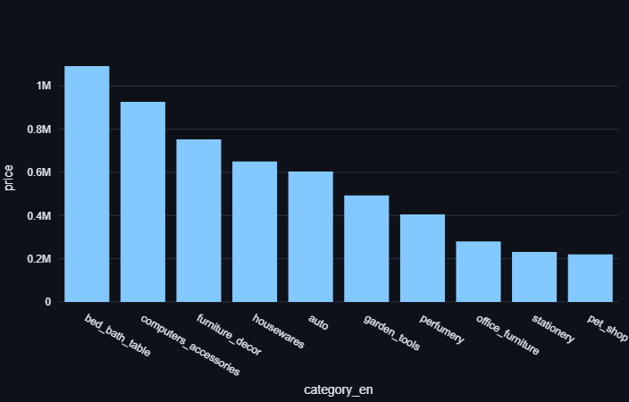
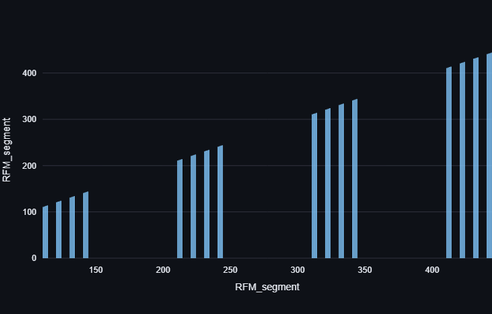

# 🛒 E‑Commerce Analytics Dashboard


An interactive Streamlit dashboard for analyzing Brazilian e‑commerce data.  
It covers **sales trends, delivery performance, customer intelligence, and advanced visualisations** with Plotly.

---

## 📸 Screenshots





---

## 📂 Folder Structure

project-root/
│── app.py
│── config.py
│── requirements.txt
│── data/
│   ├── cleaned_olist_data.csv
│   ├── rfm.csv
│   └── df_cohort.csv
│── assets/
│   ├── sunburst.html
│   ├── rfm3d.html
│   └── screenshots...


---

## ⚙️ Installation
```bash
git clone https://github.com/yourusername/ecommerce-dashboard.git
cd ecommerce-dashboard
pip install -r requirements.txt


